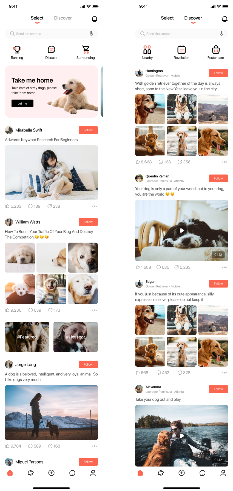

Dogdom Mobile UI
=====================================

Overview
--------

Dogdom is a mobile UI application developed using Kotlin and Jetpack Compose. It provides a delightful user interface for interacting with information related to dogs.

Figma Screenshot
-----------


Preview
-----------


Technologies Used
-----------------

- [Kotlin](https://kotlinlang.org/)
- Jetpack Compose

How to Run
----------

1. Clone the repository:

```bash
    git clone https://github.com/DevHumbleChris/Dogdom.git
```

2. Open the project in Android Studio.
3. Run the app on an emulator or a physical device.

Code Structure
--------------

The codebase is organized as follows:

- `app/src/main/java/com/example/dogdom/` - Contains the main source code.
- `app/src/main/res/` - Contains resources such as layout files and drawables.

Dependencies
------------

- Android Gradle Plugin
- Jetpack Compose
- Navigation

```kotlin
    implementation("androidx.navigation:navigation-compose:2.7.6")
```

- Fonts

```kotlin
    implementation("androidx.compose.ui:ui-text-google-fonts:1.5.4")
```

Contributing
------------

Feel free to submit issues and pull requests. Contributions are welcome!

License
-------

This project is licensed under the MIT License.

Acknowledgments
---------------

I would like to express my gratitude to [@Hutsy](https://twitter.com/Hutsydev) for making UI development in Android more enjoyable.

Contact
---------------

For any inquiries or feedback, please contact [christopherodhiambo254@gmail.com](christopherodhiambo254@gmail.com)
